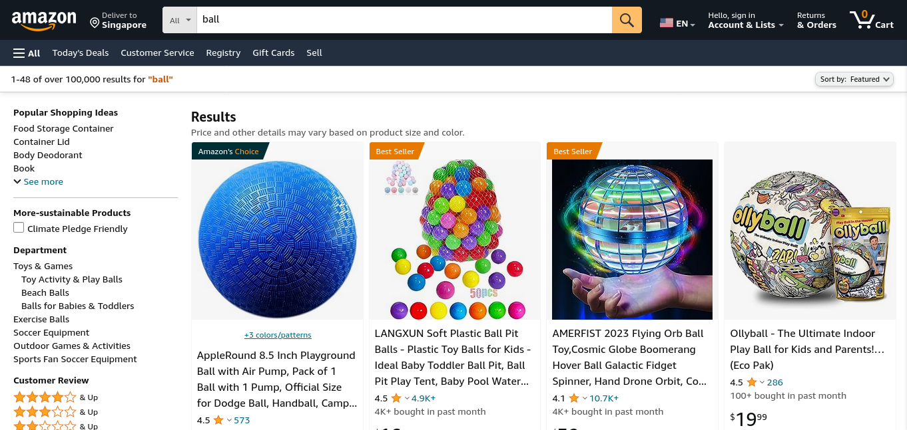

# Getting the cookie string from amazon

1. Search anything in amazon
   

2. Open the developer tools. And open the network tab.
   

3. Find the Get Request method
   

4. Lastly, find the cookie in the request header
   
